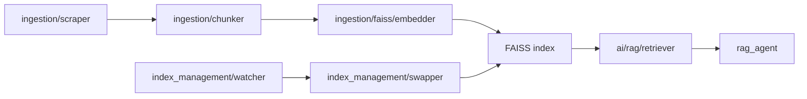
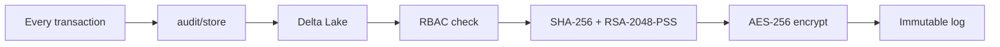
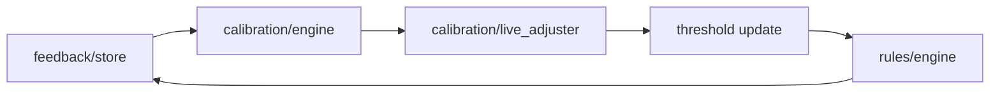

# ComplianceLoop

Multi-agent NBFC compliance decisioning for RBI and DPDP 2026 controls.

## Architecture Overview

ComplianceLoop accepts an application request, routes it through LangGraph, collects evidence from five specialist agents, and returns a final decision through the core pipeline. The pipeline persists an audit record before the API responds. Reviewer feedback flows back into calibration and rule thresholds.

```mermaid
flowchart LR
    UserReq["User Request"] --> documentAgent["document_agent"]
    documentAgent --> ragAgent["rag_agent"]
    ragAgent --> transactionAgent["transaction_agent"]
    transactionAgent --> sanctionAgent["semantic_agent"]
    sanctionAgent --> temporalAgent["temporal_agent"]
    temporalAgent --> decisionAgent["decision_agent"]
    
    decisionAgent --> corePipeline["ai/core/pipeline"]
    corePipeline --> Response["Response"]
    Response --> feedbackStore["feedback/store"]
    feedbackStore --> calibrationEngine["calibration/engine"]

    %% Feedback loops
    calibrationEngine -.->|calibration loop| decisionAgent
    calibrationEngine -.->|data sync| corePipeline
```



## Project Structure

```text
multi-agent-model/
├── ai/
│   ├── core/
│   ├── agents/
│   ├── rag/
│   ├── prompts/
│   └── llm/
├── audit/
├── rules/
├── feedback/
├── index_management/
├── calibration/
├── observability/
├── ingestion/
│   ├── scraper/
│   ├── chunker/
│   └── faiss/
└── tests/
    ├── unit/
    ├── integration/
    └── ingestion/
```

## Tech Stack

| Layer | Technology | Purpose |
|---|---|---|
| API | FastAPI | HTTP surface, lifecycle, dependency injection |
| Agent orchestration | LangGraph | Deterministic multi-agent execution |
| LLM | AWS Bedrock Claude | Final decision synthesis |
| Retrieval | FAISS | Vector index for RBI circular retrieval |
| Embeddings | sentence-transformers BGE | Query and document embeddings |
| Data ingestion | Python scraper and chunker | RBI circular acquisition and preprocessing |
| Audit | Delta Lake | Append-only analytical audit storage |
| Cryptography | SHA-256, RSA-2048-PSS, AES-256 | Integrity, signatures, encryption |
| Observability | Structured logs and metrics | Debugging, SLOs, drift detection |
| Packaging | Docker and docker-compose | Local and deployment runtime |
| Testing | pytest | Unit, integration, ingestion verification |

## Getting Started

Prerequisites: Python 3.11+, Docker, AWS credentials with Bedrock access, and FAISS build support for your platform.

```bash
cp .env.example .env
export AWS_REGION=ap-south-1
export BEDROCK_MODEL_ID=anthropic.claude-3-sonnet-20240229-v1:0
export ENVIRONMENT=development
export ENV=development
export CORS_ORIGINS=http://localhost:3000
export INDEX_DIR=ingestion/data/indexes/
```

```bash
docker compose up --build
```

```bash
python -m ingestion.run_pipeline
uvicorn main:app --host 0.0.0.0 --port 8000 --reload
```

## Agent Responsibilities

| Agent | Responsibility | Input | Output | Triggered by |
|---|---|---|---|---|
| `decision_agent` | Synthesize final status and confidence | Aggregated agent state, calibration context | `ComplianceOutput` | Incoming compliance request |
| `document_agent` | Validate required KYC documents | Documents, required document list | Missing-doc signals | `decision_agent` graph fan-out |
| `rag_agent` | Retrieve RBI context from FAISS | Query text, vector index | Clause context and sources | `decision_agent` graph fan-out |
| `sanctions_agent` | Screen names and identifiers | PAN, applicant name | Match and sanction status | `decision_agent` graph fan-out |
| `temporal_agent` | Check expiry and time validity | Document metadata and expiry dates | Expired document signals | `decision_agent` graph fan-out |
| `transaction_agent` | Apply FOIR and repayment checks | Income, EMI, tenure, amount | FOIR pass/fail signals | `decision_agent` graph fan-out |

•	Step 1 — Input: ComplianceInput JSON arrives at POST /ai/process containing user_data (dict), documents (list of S3 URLs), query (string)
•	Step 2 — Validation: OpenCV downloads and validates document images from S3 — checks presence, readability, and basic format integrity
•	Step 3 — RAG Retrieval: BGE embeds the query, FAISS searches updated_index for top-5 regulation chunks, returns [{clause_id, text, source, score}]
•	Step 4 — Agent Pipeline (LangGraph): all 5 agents execute against shared AgentState — document_agent, rag_agent, transaction_agent, sanctions_agent, temporal_agent — each writing to agent_outputs dict
•	Step 5 — Decision Agent: collects all agent_outputs + rag_context, constructs grounded prompt, calls Bedrock Claude, parses JSON response into ComplianceOutput
•	Step 6 — Output Formatting: DecisionEngine adds timestamp, request_id, validates all required fields, enforces status enum constraint
•	Step 7 — Audit: hash-chain log written to S3 with rules_used, decision, confidence, and SHA-256 of input payload

## RAG Pipeline

The ingestion path scrapes RBI circulars, normalizes them into chunkable text, embeds the chunks, and builds FAISS indexes consumed by `rag_agent`. `index_management` handles safe swaps when a newer index is available.



## Compliance And Audit Architecture

The audit path records every decision before response completion. SHA-256 is used for deterministic content hashing. RSA-2048-PSS is used for asymmetric signatures because PSS is the current safe padding mode for long-lived signatures. AES-256 is used for record encryption at rest because the access pattern is symmetric and service-bound.



## Calibration Engine

Calibration consumes reviewer outcomes, computes error by confidence bucket, and updates live thresholds without code changes. `live_adjuster` applies the active penalty model to each decision.



## Observability

Structured logs carry request identifiers and scrubbed fields. Metrics are emitted per decision, agent error, and model call so the system can surface latency, failure rate, and confidence drift.

| Metric | Type | Description | Module |
|---|---|---|---|
| `ComplianceDecision` | Counter | Count by final status | `observability/metrics.py` |
| `ProcessingTime` | Histogram or timer | End-to-end request duration | `observability/metrics.py` |
| `Confidence` | Gauge or distribution | Final confidence distribution | `observability/metrics.py` |
| `AgentError` | Counter | Error count by agent and recoverability | `observability/metrics.py` |
| `BedrockLatency` | Histogram or timer | Bedrock call latency | `observability/metrics.py` |
| `BedrockFailure` | Counter | Failed or fallback model calls | `observability/metrics.py` |

## Test Suite

| Test file | Component under test | What is verified | Type |
|---|---|---|---|
| `tests/unit/test_schemas.py` | Core schemas | Validation, defaults, state shape | unit |
| `tests/unit/test_agents.py` | Agents and core engine | Agent behavior, decision parsing, output formatting | unit |
| `tests/unit/test_rag.py` | RAG modules | Embedding, FAISS indexing, retrieval, query handling | unit |
| `tests/unit/test_audit.py` | Audit subsystem | Record construction, hash chain, API behavior | unit |
| `tests/unit/test_calibration.py` | Calibration subsystem | ECE math, live adjustment, API behavior | unit |
| `tests/unit/test_rules.py` | Rules split target | Scaffold reserved for extracted rule-only cases | unit |
| `tests/unit/test_feedback.py` | Feedback split target | Scaffold reserved for extracted feedback-only cases | unit |
| `tests/integration/test_pipeline.py` | API pipeline | End-to-end processing and health endpoints | integration |
| `tests/integration/test_compliance_loop.py` | Rules, feedback, index management | Cache, swap, summary, calibration dataset behavior | integration |
| `tests/ingestion/test_faiss_builder.py` | Ingestion FAISS builder | Build, load, search, dual-index generation | ingestion |

```bash
pytest tests/unit/
pytest tests/integration/
pytest tests/ingestion/
pytest --cov=ai --cov-report=term-missing
```

Component: schemas  
File: `tests/unit/test_schemas.py`  
Cases:
- `test_compliance_input_auto_generates_request_id`: asserts empty `request_id` becomes a UUID.
- `test_compliance_input_rejects_blank_query`: asserts whitespace-only `query` raises validation.
- `test_compliance_output_caps_confidence_on_unrecoverable_errors`: asserts confidence is capped at `0.6`.

Component: agents  
File: `tests/unit/test_agents.py`  
Cases:
- `test_document_agent_fails_on_missing_required_docs`: asserts `missing_docs` contains the absent label.
- `test_rag_agent_populates_rag_context_on_success`: asserts retrieved clauses are written to state.
- `test_sanctions_agent_flags_exact_pan_match`: asserts sanctioned status is `True` on exact PAN hit.
- `test_decision_agent_falls_back_on_invalid_json`: asserts malformed LLM output returns `REVIEW`.

Component: rag  
File: `tests/unit/test_rag.py`  
Cases:
- `test_embedder_produces_normalized_vectors`: asserts embedding norms are approximately `1.0`.
- `test_build_index_metadata_mismatch_raises`: asserts metadata count mismatch raises `ValueError`.
- `test_query_handler_formats_results_correctly`: asserts output keys include `clause_id`, `text`, `source`, `score`.

Component: audit  
File: `tests/unit/test_audit.py`  
Cases:
- `test_build_audit_record_populates_all_fields`: asserts content hash and decision fields are present.
- `test_hash_chain_verify_detects_tampered_record`: asserts tampering breaks verification.
- `test_override_endpoint_rejects_invalid_api_key`: asserts the endpoint returns `403`.

Component: calibration  
File: `tests/unit/test_calibration.py`  
Cases:
- `test_ece_is_high_for_overconfident_model`: asserts ECE exceeds the configured threshold.
- `test_live_adjuster_clamps_confidence_to_zero_minimum`: asserts adjusted confidence never goes negative.
- `test_calibration_run_applies_rules_when_flag_set`: asserts rule application is invoked when requested.

Component: rules  
File: `tests/integration/test_compliance_loop.py`  
Cases:
- `test_rule_engine_returns_default_on_empty_dynamo`: asserts `FOIR_LIMIT` falls back to the default value.
- `test_rule_engine_caches_rules_for_ttl_seconds`: asserts the second read does not hit DynamoDB.
- `test_rule_reset_restores_default_value`: asserts reset returns the seeded default.

Component: feedback  
File: `tests/integration/test_compliance_loop.py`  
Cases:
- `test_feedback_save_prevents_duplicate_for_same_request`: asserts duplicate feedback raises the expected error.
- `test_feedback_disagreement_triggers_audit_override`: asserts disagreement calls audit override.
- `test_feedback_summary_computes_accuracy_correctly`: asserts summary accuracy equals `0.75` for `3/4` agreement.

Component: pipeline  
File: `tests/integration/test_pipeline.py`  
Cases:
- `test_pipeline_full_happy_path`: asserts a valid request returns a successful compliance output.
- `test_pipeline_returns_review_on_bedrock_failure`: asserts model failure degrades to `REVIEW`.
- `test_ready_endpoint_returns_503_when_faiss_not_loaded`: asserts readiness blocks on missing index.

Component: compliance_loop  
File: `tests/integration/test_compliance_loop.py`  
Cases:
- `test_index_swapper_swap_validates_new_index_before_committing`: asserts validation runs before swap commit.
- `test_index_swapper_aborts_on_validation_failure`: asserts the old retriever remains active.
- `test_calibration_dataset_raises_on_insufficient_records`: asserts dataset creation fails below minimum sample count.

Component: faiss_builder  
File: `tests/ingestion/test_faiss_builder.py`  
Cases:
- `test_build_and_load`: asserts persisted index artifacts load back successfully.
- `test_search`: asserts nearest-neighbor search returns scored hits.
- `test_build_two_indexes`: asserts master and updated indexes are both generated.

## Configuration Reference

| Var | Type | Default | Description |
|---|---|---|---|
| `APP_VERSION` | string | `1.0.0` | Version exposed by health endpoints |
| `ENVIRONMENT` | string | `production` | Runtime environment label |
| `ENV` | string | `production` | Controls docs visibility |
| `LOG_LEVEL` | string | `INFO` | Application log level |
| `CORS_ORIGINS` | string | `https://yourdomain.com` | Allowed origins, comma separated |
| `AWS_REGION` | string | `ap-south-1` | Region for Bedrock and AWS clients |
| `BEDROCK_MODEL_ID` | string | `anthropic.claude-3-sonnet-20240229-v1:0` | Claude model identifier |
| `BEDROCK_MAX_RETRIES` | integer | `3` | Bedrock retry ceiling |
| `BEDROCK_TIMEOUT_SECONDS` | integer | `30` | Bedrock per-call timeout |
| `INDEX_MASTER_PATH` | string | `ingestion/data/indexes/master_index` | Primary FAISS index path |
| `INDEX_UPDATED_PATH` | string | `ingestion/data/indexes/updated_index` | Candidate hot-swap index path |
| `RAW_DATA_DIR` | string | `ingestion/data/raw/` | RBI raw document storage |
| `CLEANED_DATA_DIR` | string | `ingestion/data/cleaned/` | Normalized circular text |
| `INDEX_DIR` | string | `ingestion/data/indexes/` | FAISS artifact directory |
| `MASTER_INDEX_NAME` | string | `master_index` | Default production index name |
| `UPDATED_INDEX_NAME` | string | `updated_index` | Default hot-swap index name |
| `CHUNK_SIZE` | integer | `512` | Chunk size for ingestion |
| `CHUNK_OVERLAP` | integer | `64` | Chunk overlap for ingestion |
| `BGE_MODEL_NAME` | string | `BAAI/bge-small-en-v1.5` | Embedding model |
| `SANCTIONS_LIST_PATH` | string | `ingestion/data/sanctions.json` | Sanctions dataset path |
| `EMBED_BATCH_SIZE` | integer | `32` | Embedding batch size |

## Security Architecture

The system signs immutable audit content with SHA-256 digests and RSA-2048-PSS signatures, encrypts protected records with AES-256, and gates administrative actions through RBAC. Immutability depends on append-only audit writes, signature verification, and key separation between write, review, and read paths.

## Roadmap

- Replace mock sanctions screening with a regulated upstream source and deterministic fallback policy.
- Split `tests/unit/test_rules.py` and `tests/unit/test_feedback.py` into active unit coverage.
- Move cryptographic key management to KMS-backed envelope encryption and signature rotation.
- Add calibration drift alerts tied to confidence bucket shift and reviewer disagreement rate.

## Contributing

Keep module boundaries intact during changes: runtime decisioning in `ai/`, audit and control planes in top-level domain packages, ingestion offline, and tests split by scope. Update diagrams, path references, and test documentation in the same change when modules move.

## License

No license file is included in this repository. Treat the code as proprietary until a license is added.
